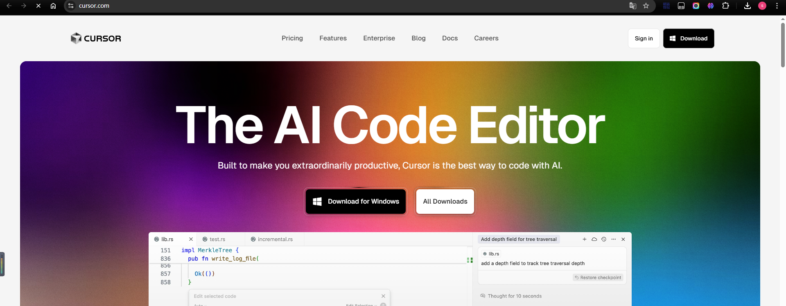
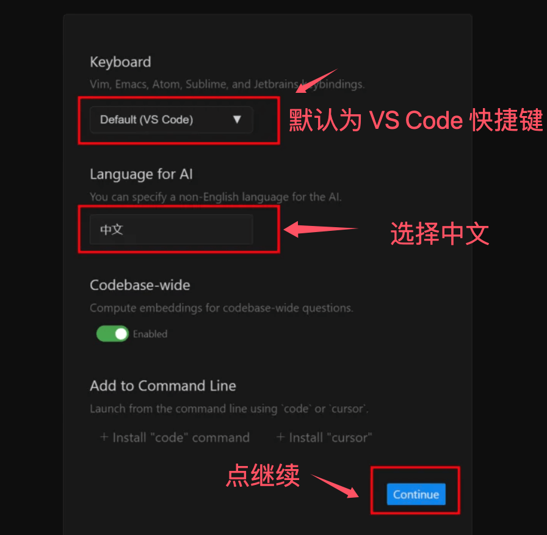
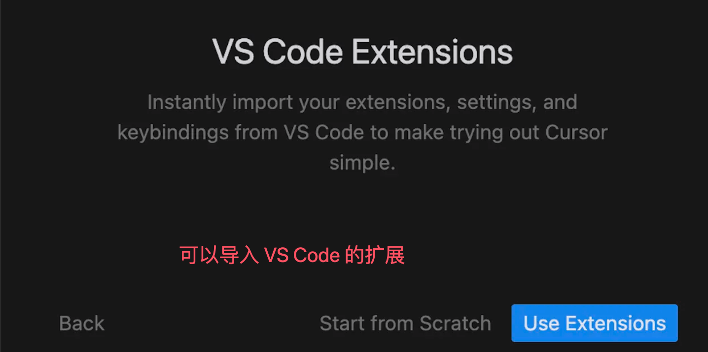
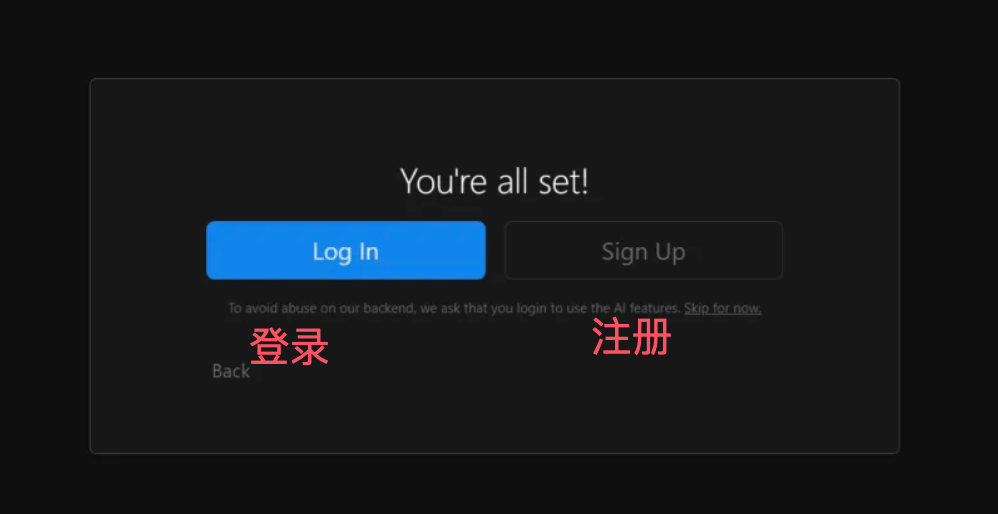
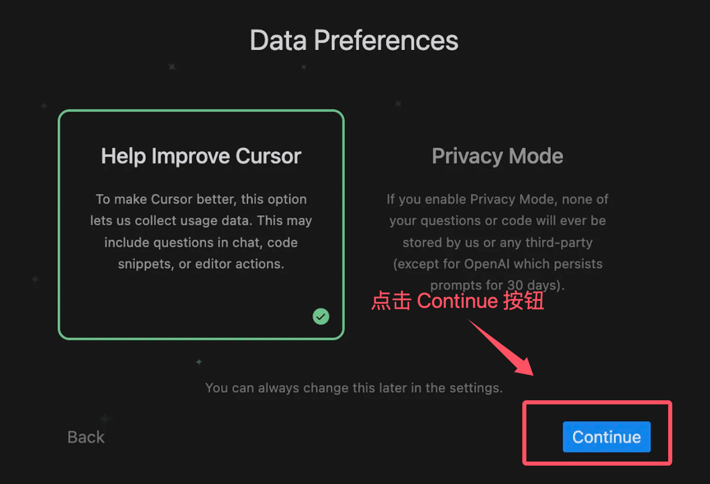

# Cursor 安装

Cursor 是一款跨平台的代码编辑器，支持 Windows、macOS 和 Linux 系统。

👉 [Cursor 官方下载页面](https://www.cursor.com/downloads)

---


## 最低系统要求

| 操作系统   | 版本要求                           | 架构支持                     |
| ---------- | ---------------------------------- | ---------------------------- |
| **Windows** | Windows 10 版本 1903 或更高        | x64, ARM64                   |
| **macOS**  | macOS 10.15 Catalina 或更高        | Intel x64, Apple Silicon (M1/M2) |
| **Linux**  | Ubuntu 18.04+, Debian 10+, RHEL 8+, SUSE 15+ | x64, ARM64                   |

### 硬件要求
- **内存 (RAM)**：最低 4GB，推荐 8GB 或更多
- **存储空间**：至少 2GB 可用磁盘空间
- **处理器**：支持 SSE2 的 x64 或 ARM64 处理器
- **网络连接**：稳定的互联网连接（AI 功能必需）
- **显示器**：分辨率至少 1024x768

默认情况下访问 [Cursor 官网](https://www.cursor.com/)，会自动匹配对应系统的安装包。
- Windows：下载 `.exe`
- macOS：下载 `.dmg`
- Linux：下载 `.deb` 或 `.rpm`


---

## 一、Windows 系统

1. 打开 [Cursor 官网](https://www.cursor.com/)，点击 **Download for Windows** 下载 `.exe` 文件
2. 双击运行安装包，选择安装路径（推荐默认路径）
3. 点击 **Install**，等待安装完成
4. 点击 **Finish**，启动 Cursor 编辑器


---

## 二、macOS 系统

1. 打开 [Cursor 官网](https://www.cursor.com/)，点击 **Download for Mac** 下载 `.dmg` 文件
2. 双击 `.dmg` 文件，将 Cursor 拖到 **Applications** 文件夹
3. 在 **Applications** 文件夹中双击 Cursor 图标启动


---

## 三、Linux 系统

1. 打开 [Cursor 官网](https://www.cursor.com/)，点击 **Download for Linux**，下载 `.deb` 或 `.rpm` 包


### Debian/Ubuntu 系统
```bash
sudo dpkg -i cursor_<version>_amd64.deb
sudo apt-get install -f
```

### Fedora/Red Hat 系统
```bash
sudo rpm -ivh cursor_<version>_x86_64.rpm
```

---

## 四、注册与登录

1. 安装完成后，选择语言（推荐中文）

      


2. 如果本机安装过 VS Code，可以导入 VS Code 扩展

   

3. 首次使用需注册账号（支持 GitHub 登录）

   

4. 按提示完成设置，点击 **Continue** 即可

   
