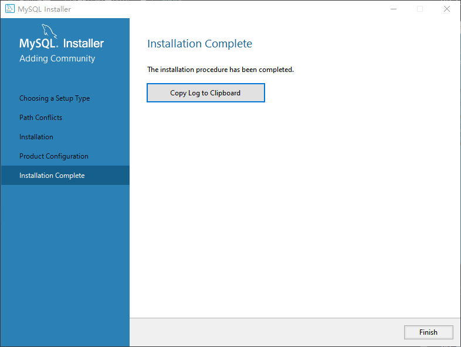

# 详述 MySQL 数据库的安装及配置

## 数据库mysql安装
首先，下载 MySQL 数据库的安装包： (https://dev.mysql.com/downloads/installer/).

下载完成之后，双击打开此`msi`文件，进入如下界面：

1. Server only
- 只安装 **MySQL Server（数据库服务端）**
- 场景：服务器只作为数据库运行环境

2. Client only
- 只安装 **MySQL 客户端工具**（如 Workbench、命令行工具）
- 不安装数据库服务端
- 用途：只连接和管理远程 MySQL 服务器
- 场景：开发电脑需要管理远程数据库，但不本地运行 MySQL

3. Full
- 安装 **所有 MySQL 产品和功能**（Server + Client + 开发工具 + 示例数据库等）
- 用途：学习、测试、本地开发
- 优点：省心，不用挑
- 缺点：占用空间大，可能装了用不到的东西

4. Custom
- **自定义选择**要安装的组件（Server、Workbench、Connector、示例库等）
- 用途：根据需求自由搭配
- 场景：想安装 Server + Workbench，但不需要文档或示例数据库

---

在此，咱们只需要选择默认的 `Server only`即可，然后点击`Next`，进入如下界面：

如上图所示，此为安装位置提示界面，直接点击`Execute` 或修改安装和数据位置后点击：

点击`Execute` 显示安装进度

如上图所示，此界面展示了当前的状态、进度及升级信息，当升级进度达到`100%`后，如下图所示：

如上图所示，此为 MySQL 数据库升级成功的标志，点击`Next`：

如上图所示，提示咱们已经进入了产品配置的阶段，直接点击`Next`即可：

- 标注1：配置服务器类型；
- 标注2：选择`TCP/IP`协议；
- 标注3：选择端口号为`3306`.

如上图所示，选择默认配置即可，点击`Next`：

如上图所示，此界面为设置账号和角色，在这里，咱们只需要设置`root`账号的密码（必须记住，登录 MySQL 数据库时需要验证）即可，密码至少四位，设置完成后，点击`Next`：

- 标注1：由于咱们使用的是`mysql-8.0`版本，因此默认的服务器名称为`MySQL80`；
- 标注2：默认选择`Standard System Account`即可。

如上图所示，选择默认配置即可，点击`Next`：

如上图所示，此为配置`Plugins and Extension`，即配置插件和扩展应用的，不用管它，直接点击`Next`即可：

如上图所示，此界面为让咱们确认需要应用的服务器配置，确认无误后，点击`Execute`：

如上图所示，服务器配置完成，点击`Finish`：

如上图所示，进一步显示配置完成，直接点击`Next`：

如上图所示，到这来，咱就已经将 MySQL 安装完成啦，直接点击`Finish`即可。 
 

----------

**温馨提示**：在这里，咱们仅仅安装了 MySQL 数据库的服务器，至于客户端工具，推荐`Navicat`

----------

