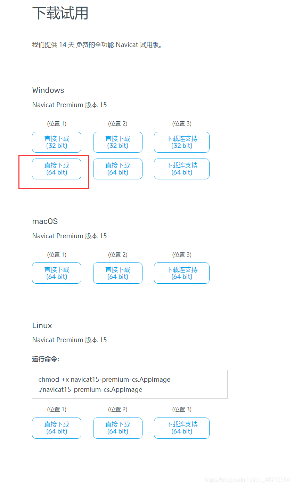
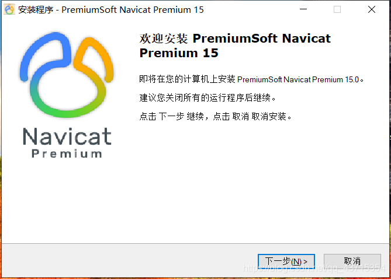
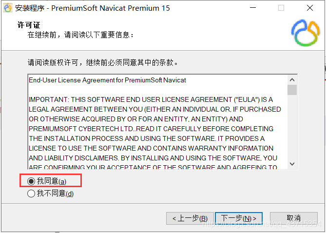
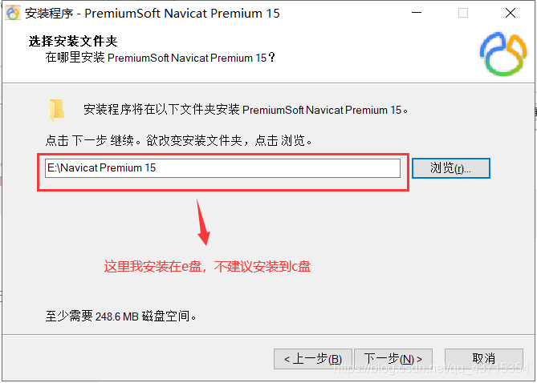
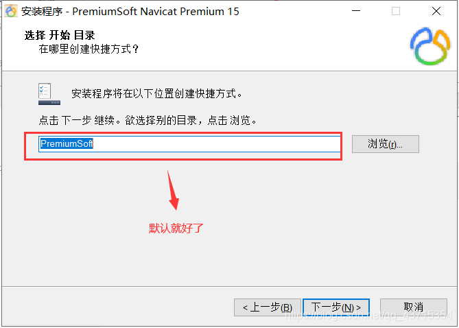
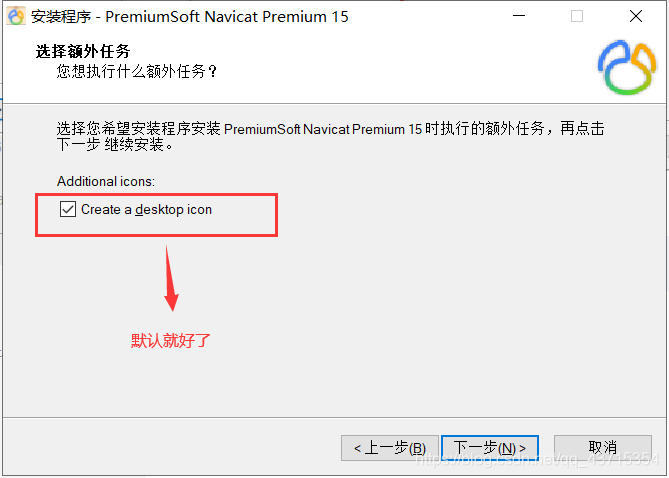
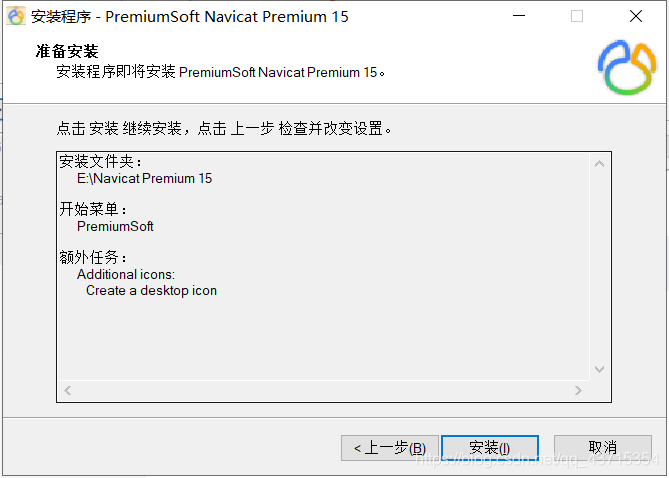
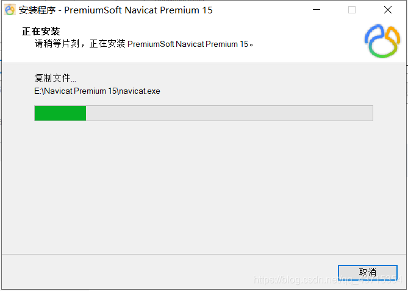
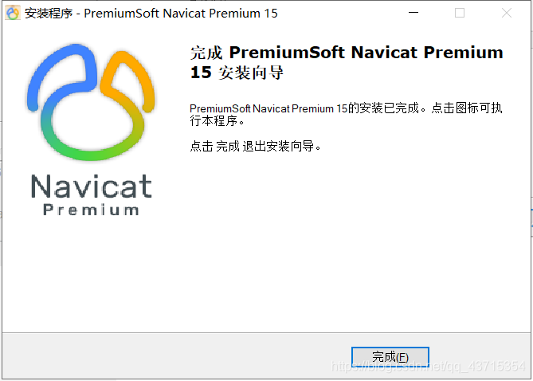

# Navicat 安装教程（超详细）

> 大家好，今天我们来学习一下 Navicat15 安装教程与破解，好好看，好好学，超详细的。

---

## 第一步
> 进入 [**Navicat 官网**](http://www.navicat.com.cn/download/navicat-premium)，找到你需要的安装包（这里安装的是 Navicat15），如下图所示：

---

## 第二步
> 下载好了安装包直接点击安装进入安装界面，如下图所示：

---

## 第三步
> 点击下一步进入许可证选择界面，如下图所示：

---

## 第四步
> 点击下一步进入选择安装路径界面，如下图所示：

---

## 第五步
> 点击下一步进入选择创建快捷方式界面，如下图所示：

---

## 第五步（额外任务）
> 点击下一步进入选择额外任务界面，如下图所示：

---

## 第五步（准备安装）
> 点击下一步进入选择准备安装界面，如下图所示：

---

## 第六步
> 点击安装，等待安装就行了，如下图所示：

  

> 这样 Navicat 就安装成功了 ✅
